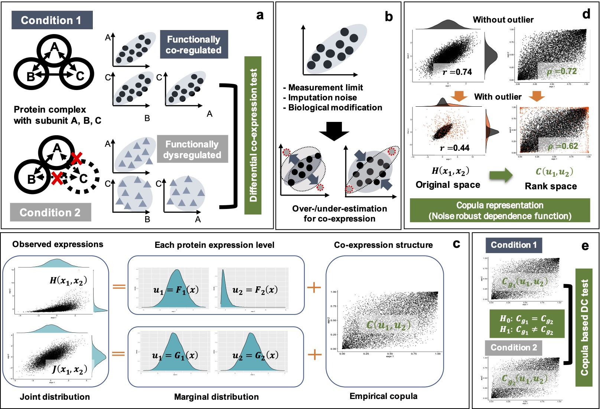
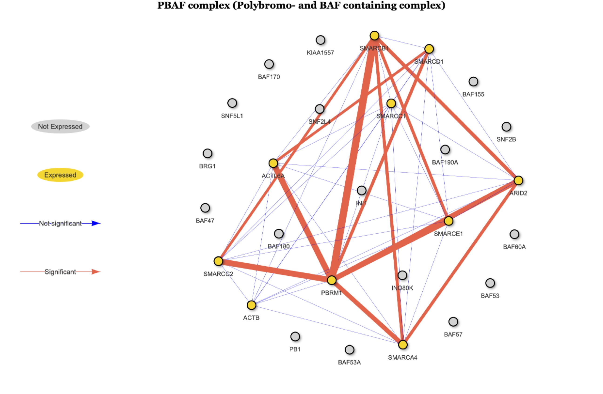
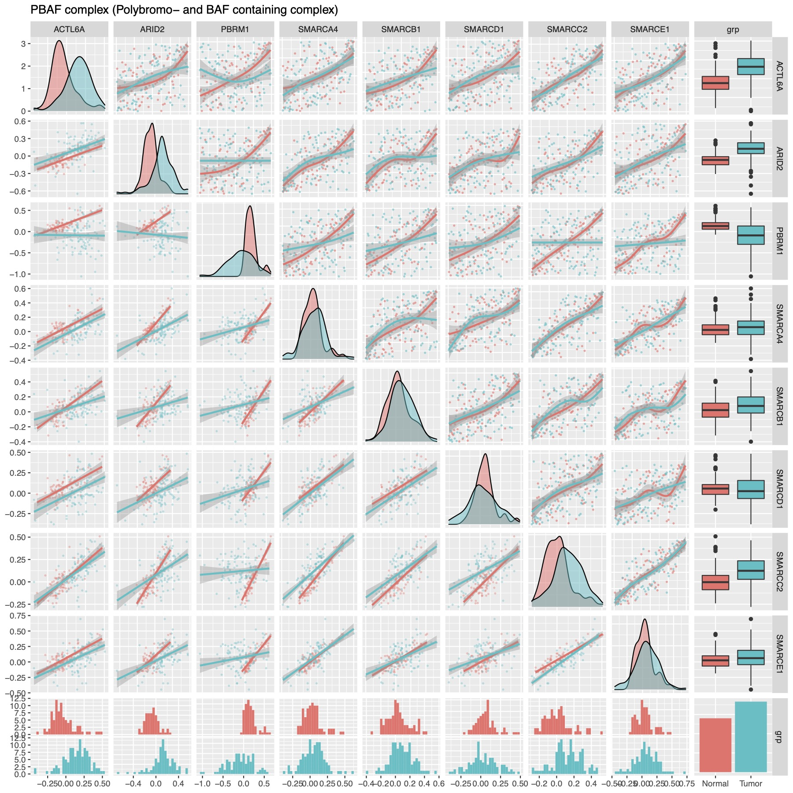

```{r setup, include = FALSE}
knitr::opts_chunk$set(
  collapse = TRUE,
  comment = "#>"
)
```

## Introduction

  Cancer is a complex system. Many molecular events, such as genomic mutations and epigenetic and transcriptomic dysregulations, were iden-tified as cancer drivers (Hoadley et al., 2018). However, our knowledge of how they characterize the downstream mechanisms with proteomic phenotypes remains scarce (Clark et al., 2019; Liu et al., 2016; Mertins et al., 2016; Zhang et al., 2016). Protein complexes are responsible for most cellar activities. Recent studies (Ori et al., 2016; Romanov et al., 2019; Ryan et al., 2017) demonstrate that protein subu-nits tend to show co-expression patterns with proteome profiles; fur-thermore, the subunits of a complex are simultaneously down-/up-regulated with the genomic mutations (Ryan et al., 2017). However, we know little about the changes in the co-regulatory modes of protein complexes between the tumor and normal tissues.


  We propose a novel algorithm for differential co-expression of protein abundances to identify the tumor-specific abnormality of pro-tein complexes. Differential co-expression (DC) analysis is a standard technique of gene expression analysis to find differential modes of co-regulation between conditions, and numerous methods already exist (Bhuva et al., 2019). Correlation is one of the most common measures of co-expression. For example, differential correlation analysis (DiffCorr) (Fukushima, 2013) and gene set co-expression analysis (GSCA) (Choi and Kendziorski, 2009) are two-sample tests of Pear-son’s correlation coefficients. However, studies report that protein expression levels have greater variability than gene expression levels because of  a regulatory mechanism of post-translational modifications (Gunawardana et al., 2015; Liu et al., 2016). This variability can affect the estimation of co-expression as an outlier and can have significant impact on DC results.
  
    
  We develop a robust DC framework, called Robust Differential Co-Expression Analysis (RoDiCE), via two-sample randomization tests with empirical copula. The notable advantage of RoDiCE is noise ro-bustness. Our main contributions are as follows: 1) we develop efficient algorithm of robust copula-based statistical DC testing, 2) we overcome computational hurdles of copula-based permutation test by incorporat-ing the extreme value theory, 3) we demonstrate the effective applica-tion of copula to cancer complexome analysis, and 4) we develop a computationally efficient multi-thread implementing as R package. 
  
```{r,echo=FALSE,message=FALSE,warning=FALSE,out.width="85%"}

```


## Install
```{r,message=FALSE,warning=FALSE,eval=FALSE}
install.packages("RoDiCE")
```

```{r,message=FALSE,warning=FALSE,eval=FALSE}
install.packages("RoDiCE")
```


```{r,message=FALSE,warning=FALSE}
library(RoDiCE)
```

## Required data
The required data are a protein/gene expression data frame and a data frame representing the subunit membership in the protein complex. In this vignette, protein expression data from clear renal cell carcinoma (ccRCC) and CORUM are used as examples.  

The expression data assumes that the column direction represents the protein and the direction represents the sample.  

### Protein expression data
```{r,warning=FALSE,message=FALSE}
data(ccrcc.subset)
```

ccrcc.subset contains protein expression data of tumor and normal groups in list.
```{r,warning=FALSE,message=FALSE}
names(ccrcc.subset)
tumor = ccrcc.subset$tumor
normal = ccrcc.subset$normal
```

There were 110 and 84 samples in the tumor and normal groups, respectively, and contained 49 protein expression data.

```{r,warning=FALSE,message=FALSE}
dim(tumor)
dim(normal)
```

### Protein complex dataset
For protein complexes, the data downloaded from CORUM are used. The function `parse_corum()` returns the result of processing the data downloaded from CORUM. The following extracts information of protein complexes for human.

```{r,warning=FALSE,message=FALSE}
corum = parse.corum("Human")
names(corum)
str(corum$comp.tbl)
```

In the following steps, the `tbl` element is used.
```{r,message=FALSE,warning=FALSE}
head(corum$comp.tbl)
```
Since only proteins derived from five protein complexes were included in the current protein expression data, only the corresponding protein complexes will be extracted.

```{r,message=FALSE,warning=FALSE}
ref = corum$comp.tbl
ref = ref[ref$group_id %in% c(6789,5273,6909,149,929),]
```


## Construct expression objects by protein complex
The function `group.exprs()` groups the expression data of proteins into individual protein complexes.
```{r,message=FALSE,warning=FALSE}
tumor_comp = group.exprs(tumor,ref)
normal_comp = group.exprs(normal,ref)
```

```{r,message=FALSE,warning=FALSE}
names(tumor_comp)
names(normal_comp)
```


Protein expression matrices for each complex are stored in `comp.exprs`, and the names and IDs of protein complexes are hidden in `comp.names` and `comp.ids`.

```{r,message=FALSE,warning=FALSE}
cbind(tumor_comp$comp.names,tumor_comp$comp.ids)
```

For example, to access the protein expression data contained in the PBAF complex, we do the following
```{r,message=FALSE,warning=FALSE}
head(tumor_comp$comp.exprs[[1]])
```

### Perform two sample copula-based testing
Based on the expression data of the obtained protein complexes, we will test for differential co-expression between the two groups.`The coptest.p()` function tests the difference in co-expression of each protein pair within a given complex between two groups, x1 and x2. Various n-dependent differences, including linear and non-linear relationships, can be robustly identified against noise.

```{r,message=FALSE,warning=FALSE}
x1 = tumor_comp$comp.exprs[[1]]
x2 = normal_comp$comp.exprs[[1]]
result = coptest.p(x1,x2,nperm = 100,approx = FALSE)
```

The result object contains `tbl` and `perm.out`. tbl` is mainly used in order to check the result of a test.
```{r,message=FALSE,warning=FALSE}
names(result)
```

The tbl is an data.frame object, which contains a `varname` representing a protein pair, a `stat` for the test statistic, `p` for the p-value, and `p.adj` for the multiple test correction.

```{r,message=FALSE,warning=FALSE}
head(result$tbl)
```

### Visulization of results

Two functions were prepared to interpret the results. One is the `netvis()` function and the other is the `coexvis()` function. The `netvis()` function illustrates the differential co-expression network in a protein complex. The main arguments are `obj` and `ref`, where `obj` is the result object of `coptest.p()` and `ref` is the object of the protein complex to be illustrated. 


The following is an example to illustrate the PBAF complex: The object of the PBAF complex (group_id==149).

```{r,message=FALSE,warning=FALSE}
selectRef = ref[ref$group_id==149,]
```

Drawing the differential co-expression network.
```{r,eval=FALSE,message=FALSE,warning=FALSE}
netvis(obj = result,ref = selectRef)
```

```{r,echo=FALSE,message=FALSE,warning=FALSE,out.width="80%"}

```

The `coexvis()` function illustrates the co-expression pattern with a pair of scattergrams. The arguments are `obj`, `exprs`, and `grp`. `obj` is the result object of the `coptest.p()` function and `exprs` is the protein expression matrix. grp` represents groups to which each sample belongs as integers of 1 and 2.

```{r,eval=FALSE,message=FALSE,warning=FALSE}
exprs = rbind(x1,x2)
grp = c(rep(1,nrow(x1)),rep(2,nrow(x2)))
coexvis(obj = result,exprs = exprs,grp = grp)
```

```{r,echo=FALSE,message=FALSE,warning=FALSE,out.width="80%"}

```

The lower diagonal component is a pairwise scatter plot at the original scale, and the upper diagonal component is a pairwise scatter plot at the copula-transformed (rank-transformed) scale.RoDiCE identifies the differences of robust and complex co-expressed structures by testing the copula-transformed co-expressed structures between two groups.
